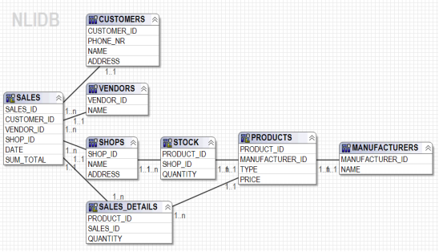

This agent allows the user to query structured data from a relational database using natural language by converting natural language questions to SQL queries (or other structured languages). Aside of relational databases, Quest supports multiple data sources, e.g. HIVE, Salesforce.com and many others. 

A semantic model of the database schema should be created during the training time. The model specifies the tables, the columns, and their relations and is used by QUEST to process the natural language questions and produce SQL queries. 

The Warehouse schema model that is shown here represents a Sales/Warehouse database with 8 tables. This schema is used with a sample Quest agent. The example questions bellow demonstrate what can be asked of this schema.

 

To try this sample, please load the yaml configuration [yaml configuration](./Quest.yaml)into your own sandbox environment. 

Sample Questions:

which products have higher price than IPHONE; show product type

what is the name of manufacturer that has manufactured lower number of products than APPLE

what manufacturer manufactured more than 2 products; add manufacturer name

what products have prices greater than GALAXYTAB;  add product type and price

what is the most expensive product; show product type

which vendor sold the most products in 2014; show vendor name

which shop has stocked the highest quantity of products; show shop name

what type of products are manufactured by SAMSUNG

how many times did Willie buy IPHONE

how many IPHONEs did Patrick buy

how many types of products did APPLE manufacture

what is the number of iphones bought by each customer before 2015; show customer name

how many customers bought more than 5 IPHONEs before 2015

how many products were sold before October 2013 in shops located in New York

how many iphones were sold before October  2013 in shops located in New York

fetch the name of  customers who bought more than 5 IPHONEs before 2015

show me the customer names who bought products between 2013 and  2015

how many products were sold between 12/2/2012 and 12/1/2015

what are the types of products that were sold on 10/11/2011 in New York.

what are the types of products that were sold since 10/11/2011 in Chicago

what shop stocked more than 10 iphones ; add shop address and name

produce the types of the products that were sold in  2013 in shops located in Chicago.

which customers bought at least 7 iphones

what is the price of the apple product that has the highest price

what is the number of each product sold.

what is the name of customers who bought iphones  3 times.

how many times did each customer buy iphones

how many customers bought iphones 3 times

how many times did each customer buy iphones

what is the name of customers who bought iphones more than 2 times.

which is the type of  product that has price above IPHONE

what is the percentage of iphones sold in NY

what percentage of iphones were sold in NY

